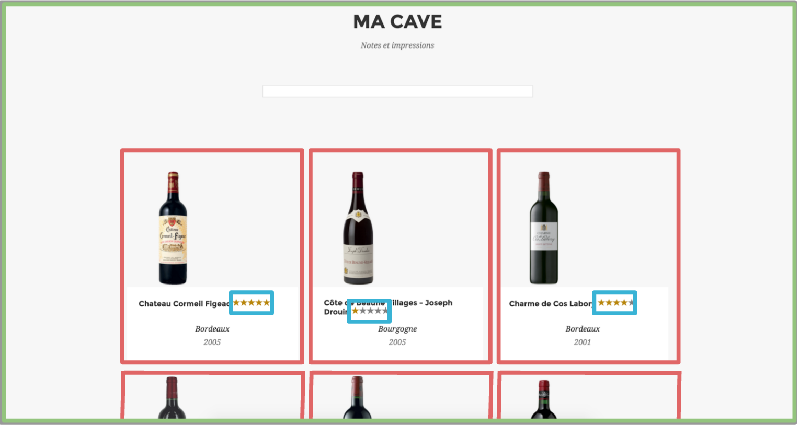

# Etape 1 - Les Directives & Composants
Ce TP a pour objectif de vous familiariser avec les **composants** *AngularJS*.

## Découpage de l'application template en components
Nous allons maintenant créer notre première version de l'application. Cette version vise à créer les différents composants de notre application. Nous allons démarrer par un découpage du template fourni [ici](app/components/cellar/home-page.html).

Nous allons découper ce template en trois directives de la manière suivante :

Nous avons identifié trois composants :
* wine-cellar : Le composant global, la **cave à vin**
* wine-card : Une **carte** correspondant à un type de vin
* wine-rating : La **notation** d'un vin

Nous allons créer ces composants dans le répertoire `components` (il s'agit d'une convention).
Pour chaque composant, créez un répertoire. Dans notre cas nous allons créer les répertoires suivants :
* `app/components/cellar` (wine-cellar)
* `app/components/cellar/card` (wine-card)
* `app/components/cellar/rating` (wine-rating)

## wine-cellar

Créez les fichiers correspondants pour le composant `wine-cellar` dans le répertoire `cellar`
* `Cellar.js` : le module
* `CellarComponent.js` : le component

Le fichier [`cellar-template.intermediate.html`](app/components/cellar/cellar-template.intermediate.html), fourni, correspond au template du composant `wine-cellar`. Comme vous pouvez le constater, ce composant référence des composants de type `wine-card` qui sont positionnés (pour le moment :D) en dur.

## wine-card

Créez les fichiers correspondants pour le composant `wine-card` dans le répertoire `cellar/card`.
* `Card.js` : le module
* `CardComponent.js` : le component : pensez au binding des données

Le composant `wine-card` contient deux attributs (bindings) :
* **desc** : la description du vin (l'objet), *two-way*
* **edit** : bindé sur `$ctrl.editedWine` du parent, *expression*

Le fichier [`card-template.html`](app/components/cellar/card/card-template.html), fourni, correspond au template du composant `wine-card`. Le contenu de ce template est bouchonné (ha ha), vous devez le débouchonner.

Pour l'instant, nous allons laisser *Etoiles* tel quel pour pouvoir tester.

## wine-rating
Nous allons maintenant créer le composant `wine-rating`.

### Filter
Nous allons maintenant créer un filter permettant de gérer l'affichage de la notation (sous forme d'étoiles). Comme vous pouvez l'observer dans le template [`rating-template.html`](app/components/cellar/rating/rating-template.html). Comme vous pouvez le constater, ce template utilise la directive [**ngRepeat**](https://docs.angularjs.org/api/ng/directive/ngRepeat), nous y reviendrons.

Dans le répertoire `cellar/rating`, créez les fichiers :
* `RatingRangeFilter.js` : le filter
* `RatingRangeFilter.spec.js` : le test unitaire

Le filter doit, à partir d'un rating, renvoyer un tableau de booléens correspondant à l'état des étoiles qui correspondent au classement du vin, dans le sens décroissant.

Exemple :
* 1 -> [false, false, false, false, true]
* 2 -> [false, false, false, true, true]
* et ainsi de suite...

Créez le filtre **et les tests unitaires** associés.

### Le composant
Créez  maintenant les fichiers correspondants au composant `wine-rating` :
* `Rating.js` : le module (n'oubliez pas le filter `range` utilisé dans le template et basé sur `RatingRangeFilter`)
* `RatingComponent.js` : le composant

Ce composant dispose d'un attribut :
* **rating** : la note du vin, *two-way*

Vous pouvez maintenant utiliser ce composant dans le template du composant `wine-card` (à la place d'*Etoiles*).

## Hide/Show

Comme vous pouvez le constater, le template `cellar-template.intermediate.html` contient deux sections : `portfolio` et `edit`. À l'aide de la directive [**ngShow**](https://docs.angularjs.org/api/ng/directive/ngShow), gérez le changement de mode entre les deux sections :
* passage en mode édition en cliquant sur une des cartes
* passage en mode portfolio en cliquant sur le bouton **Return !**

## Prochaine étape

Une fois cette étape terminée, vous pouvez aller consulter la [version corrigée](../step-1-done) puis aller jusqu'à [l'étape suivante](../step-2)
